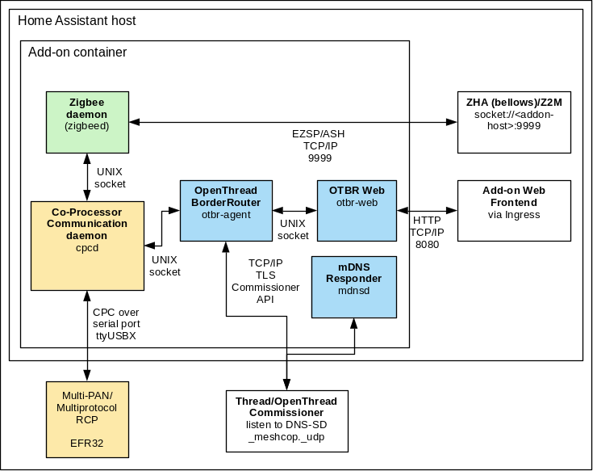

# Home Assistant Add-on: Silicon Labs Multiprotocol

**NOTE**: This add-on has the option to automatically install the right firmware for Home Assistant Yellow and Home Assistant SkyConnect. Follow [this guide](https://github.com/NabuCasa/silabs-firmware/wiki/Flash-Silicon-Labs-radio-firmware-manually) to change back to a firmware that is compatible with other Zigbee software.

## Installation

Follow these steps to get the add-on installed on your system:

1. Navigate in your Home Assistant frontend to **Settings** -> **Add-ons, Backup & Supervisor** -> **Add-on Store**.
2. Find the "Silicon Labs Multiprotocol" add-on and click it.
3. Click on the "INSTALL" button.

## How to use

The add-on needs a Silicon Labs based wireless module accessible through a
serial port (like the module on Yellow or most USB based wireless adapters).

Once the firmware is loaded follow the following steps:

1. Select the correct `device` in the add-on configuration tab and press `Save`.
2. Start the add-on.

**NOTE:** the Web frontend is only accessible when OpenThread is enabled (see below).

### Zigbee

To use Zigbee with ZHA configure the Integration as follows:

1. Remember/copy the hostname of the add-on (e.g. `c8f00288-silabs-multiprotocol`).
2. Add the Zigbee Home Automation (ZHA) integration to Home Assitant Core
3. When asked for the Serial Device Path, choose `Enter Manually`.
4. Choose `EZSP` as Radio type.
5. As serial path, enter `socket://<hostname-from-above>:9999`.
6. Port speed and flow control don't matter.
7. Press `Submit`. Adding ZHA should succeed and you should be able to use ZHA
   as if using any other supported radio type.

### OpenThread

At this point OpenThread support is experimental. This add-on makes your Home
Assistant installation an OpenThread BorderRouter (OTBR). There is no integration
in Home Assistant Core at this point.

To use the OTBR enable it in the Configuration tab and restart the add-on. With
that you will be able to access the OTBR web frontend. When joining or forming a
network make sure to use the same IEEE 802.15.4 channel for both OpenThread and
Zigbee, and *different* PAN IDs. This limitations stem from the fact that a single
radio is used.

Follow the guides at [openthread.io](https://openthread.io), e.g. the [OpenThread
Commissioner](https://openthread.io/guides/commissioner) guide.

### Automatic firmware upgrade

If the `autoflash_firmware` configuration is set, the add-on will automatically
install or update to the RCP Multi-PAN firmware if a Home Assistant SkyConnect
or Home Assistant Yellow is detected.

**NOTE:** Switching back to a Zigbee only (EmberZNet) firmware requires manual
steps currently. You can find a guide on the Nabu Casa Silicon Labs firmware
repository Wiki on flashing [Silicon Labs radio firmware
manually](https://github.com/NabuCasa/silabs-firmware/wiki/Flash-Silicon-Labs-radio-firmware-manually).

## Configuration

Add-on configuration:

| Configuration      | Description                                            |
|--------------------|--------------------------------------------------------|
| device (mandatory) | Serial sevice where the Silicon Labs radio is attached |
| baudrate           | Serial port baudrate (depends on firmware)   |
| flow_control       | If hardware flow control should be enabled (depends on firmware) |
| autoflash_firmware | Automatically install/update firmware (Home Assistant SkyConnect/Yellow) |
| network_device     | Host and port where CPC daemon can find the Silicon Labs radio (takes precedence over device) |
| cpcd_trace         | Co-Processsor Communication tracing (trace in log)     |
| otbr_enable        | Enable OpenThread BorderRouter                         |
| otbr_debug         | Start OpenThread BorderRouter Agent with debug log     |
| otbr_firewall      | Enable OpenThread Border Router firewall to block unnecessary traffic |

## Architecture

The add-on runs several service internally. This architecture diagram shows what
the add-on currently implements.

## Support

Got questions?

You have several options to get them answered:

- The [Home Assistant Discord Chat Server][discord].
- The Home Assistant [Community Forum][forum].
- Join the [Reddit subreddit][reddit] in [/r/homeassistant][reddit]

In case you've found a bug, please [open an issue on our GitHub][issue].

[discord]: https://discord.gg/c5DvZ4e
[forum]: https://community.home-assistant.io
[reddit]: https://reddit.com/r/homeassistant
[issue]: https://github.com/home-assistant/addons/issues
